# AWS Cloud Solutions Architect

## Description
This repository contains my personal notes and code for the AWS Cloud Solutions Architect Professional Certificate, I'm hopping to use this repository as a way to keep track of my progress and if in the future a need to remember something this repository will be a good place to start.  
### What is the Cloud
The cloud is a set of services and technologies that enable the delivery of computing services over the internet in real time, while offering flexibility, scalability, and a pay-per-use pricing model.
### Cloud Computing Characteristics
- **On-demand self-service:** A consumer can unilaterally provision computing capabilities, such as server time and network storage, as needed automatically without requiring human interaction with each service provider.
- **Broad network access:** Capabilities are available over the network and accessed through standard mechanisms that promote use by heterogeneous thin or thick client platforms (e.g., mobile phones, tablets, laptops, and workstations).
- **Resource pooling:** The provider’s computing resources are pooled to serve multiple consumers using a multi-tenant model, with different physical and virtual resources dynamically assigned and reassigned according to consumer demand. There is a sense of location independence in that the customer generally has no control or knowledge over the exact location of the provided resources but may be able to specify location at a higher level of abstraction (e.g., country, state, or datacenter). Examples of resources include storage, processing, memory, and network bandwidth.
- **Rapid elasticity:** Capabilities can be elastically provisioned and released, in some cases automatically, to scale rapidly outward and inward commensurate with demand. To the consumer, the capabilities available for provisioning often appear to be unlimited and can be appropriated in any quantity at any time.
- **Measured service:** Cloud systems automatically control and optimize resource use by leveraging a metering capability at some level of abstraction appropriate to the type of service (e.g., storage, processing, bandwidth, and active user accounts). Resource usage can be monitored, controlled, and reported, providing transparency for both the provider and consumer of the utilized service.

### Cloud Computing Service Models
- **Infrastructure as a Service (IaaS):** The capability provided to the consumer is to provision processing, storage, networks, and other fundamental computing resources where the consumer is able to deploy and run arbitrary software, which can include operating systems and applications. The consumer does not manage or control the underlying cloud infrastructure but has control over operating systems, storage, and deployed applications; and possibly limited control of select networking components (e.g., host firewalls).
- **Platform as a Service (PaaS):** The capability provided to the consumer is to deploy onto the cloud infrastructure consumer-created or acquired applications created using programming languages, libraries, services, and tools supported by the provider. The consumer does not manage or control the underlying cloud infrastructure including network, servers, operating systems, or storage, but has control over the deployed applications and possibly configuration settings for the application-hosting environment.
- **Software as a Service (SaaS):** The capability provided to the consumer is to use the provider’s applications running on a cloud infrastructure. The applications are accessible from various client devices through either a thin client interface, such as a web browser (e.g., web-based email), or a program interface. The consumer does not manage or control the underlying cloud infrastructure including network, servers, operating systems, storage, or even individual application capabilities, with the possible exception of limited user-specific application configuration settings.

### Cloud Computing Deployment Models
- **Private cloud:** The cloud infrastructure is provisioned for exclusive use by a single organization comprising multiple consumers (e.g., business units). It may be owned, managed, and operated by the organization, a third party, or some combination of them, and it may exist on or off premises.
- **Community cloud:** The cloud infrastructure is provisioned for exclusive use by a specific community of consumers from organizations that have shared concerns (e.g., mission, security requirements, policy, and compliance considerations). It may be owned, managed, and operated by one or more of the organizations in the community, a third party, or some combination of them, and it may exist on or off premises.
- **Public cloud:** The cloud infrastructure is provisioned for open use by the general public. It may be owned, managed, and operated by a business, academic, or government organization, or some combination of them. It exists on the premises of the cloud provider.
- **Hybrid cloud:** The cloud infrastructure is a composition of two or more distinct cloud infrastructures (private, community, or public) that remain unique entities, but are bound together by standardized or proprietary technology that enables data and application portability (e.g., cloud bursting for load balancing between clouds).

### Benefits of Cloud Computing
- **Trade capital expense for variable expense:** Instead of having to invest heavily in data centers and servers before you know how you’re going to use them, you can pay only when you consume computing resources, and pay only for how much you consume.
- **Benefit from massive economies of scale:** By using cloud computing, you can achieve a lower variable cost than you can get on your own. Because usage from hundreds of thousands of customers is aggregated in the cloud, providers such as AWS can achieve higher economies of scale, which translates into lower pay as-you-go prices.
- **Stop guessing capacity:** Eliminate guessing on your infrastructure capacity needs. When you make a capacity decision prior to deploying an application, you often either end up sitting on expensive idle resources or dealing with limited capacity. With cloud computing, these problems go away. You can access as much or as little as you need, and scale up and down as required with only a few minutes’ notice.
- **Increase speed and agility:** In a cloud computing environment, new IT resources are only ever a click away, which means you reduce the time it takes to make those resources available to your developers from weeks to just minutes. This results in a dramatic increase in agility for the organization, since the cost and time it takes to experiment and develop is significantly lower.
- **Stop spending money running and maintaining data centers:** Focus on projects that differentiate your business, not the infrastructure. Cloud computing lets you focus on your own customers, rather than on the heavy lifting of racking, stacking, and powering servers.
- **Go global in minutes:** Easily deploy your application in multiple regions around the world with just a few clicks. This means you can provide lower latency and a better experience for your customers at minimal cost.

### Cloud Computing Risks
- **Security:** The cloud is not inherently insecure. However, you must be aware of the security controls that the cloud provider offers and the security controls that you are responsible for implementing.
- **Compliance:** The cloud is not inherently compliant. However, you can use the cloud to help you meet your compliance obligations.
- **Vendor lock-in:** The cloud is not inherently a vendor lock-in. However, you must be aware of the cloud provider’s proprietary features and services that you use in your application.
- **Data loss:** The cloud is not inherently prone to data loss. However, you must be aware of the cloud provider’s data durability and availability features and the data durability and availability features that you are responsible for implementing.
- **Limited control:** The cloud is not inherently uncontrollable. However, you must be aware of the cloud provider’s management controls and the management controls that you are responsible for implementing.
- **Shared technology issues:** The cloud is not inherently prone to shared technology issues. However, you must be aware of the cloud provider’s shared technology and the shared technology that you are responsible for implementing.
- **Cloud provider failure:** The cloud is not inherently prone to cloud provider failure. However, you must be aware of the cloud provider’s service level agreements and the service level agreements that you are responsible for implementing.
- **Limited cloud provider visibility:** The cloud is not inherently opaque. However, you must be aware of the cloud provider’s monitoring capabilities and the monitoring capabilities that you are responsible for implementing.
- **Limited incident response:** The cloud is not inherently prone to limited incident response. However, you must be aware of the cloud provider’s incident response capabilities and the incident response capabilities that you are responsible for implementing.
- **Limited availability of forensic data:** The cloud is not inherently prone to limited availability of forensic data. However, you must be aware of the cloud provider’s forensic capabilities and the forensic capabilities that you are responsible for implementing. 
- **Limited business continuity:** The cloud is not inherently prone to limited business continuity. However, you must be aware of the cloud provider’s business continuity capabilities and the business continuity capabilities that you are responsible for implementing.
- **Limited disaster recovery:** The cloud is not inherently prone to limited disaster recovery. However, you must be aware of the cloud provider’s disaster recovery capabilities and the disaster recovery capabilities that you are responsible for implementing.
- **Limited capacity planning:** The cloud is not inherently prone to limited capacity planning. However, you must be aware of the cloud provider’s capacity planning capabilities and the capacity planning capabilities that you are responsible for implementing.

### Chose the Right aws Region
There is some factors that you need to consider when choosing the right region for your application, some of them are:
- **Latency:** The time it takes for a packet of data to be sent from a client to a server and back again. Latency is typically measured in milliseconds (ms).
- **Throughput:** The amount of data that can be transferred over a network in a given amount of time. Throughput is typically measured in bits per second (bps) or bytes per second (Bps).
- **Cost:** The cost of network traffic between your clients and your server.
- **Compliance:** The legal and regulatory requirements that you must comply with in a given region.
- **Service availability:** The availability of AWS services within a given region.
- **Support:** The languages that AWS support personnel speak within a given region.

### Three Ways to Interact with AWS
- **AWS Management Console:** A web-based interface for accessing and managing AWS services.
- **Command Line Interface (CLI):** A tool that allows you to interact with AWS services using commands in your command-line shell.
- **Software Development Kits (SDKs):** A set of tools that allows you to interact with AWS services using an API that is tailored to your programming language or platform.

### Starting with AWS
- **AWS Organizations:** AWS Organizations is an account management service that enables you to consolidate multiple AWS accounts into an organization that you create and centrally manage.
- **AWS Identity and Access Management (IAM):** AWS Identity and Access Management (IAM) enables you to manage access to AWS services and resources securely.
- **AWS Billing and Cost Management:** AWS Billing and Cost Management enables you to pay your AWS bill, monitor your usage, and analyze and control your costs.
- **AWS Support:** AWS Support is a one-on-one, fast-response support channel that is staffed 24x7x365 with experienced and technical support engineers.
- **AWS Personal Health Dashboard:** The AWS Personal Health Dashboard provides alerts and remediation guidance when AWS is experiencing events that may impact you.
- **AWS Trusted Advisor:** AWS Trusted Advisor provides best practices (or checks) in five categories: cost optimization, performance, security, fault tolerance, and service limits.
- **AWS Well-Architected Tool:** The AWS Well-Architected Tool helps you review the state of your workloads and compares them to the latest AWS architectural best practices.

### First Steps with AWS
#### Create an AWS Account
1. Open the [AWS Management Console](https://console.aws.amazon.com/console/home?nc2=h_ct&src=header-signin&region=us-east-1).
2. Choose **Create a new AWS account**.
3. Enter your account information, and then choose **Continue**.
4. Choose **Personal** or **Professional**.
5. Enter your company or personal information.
6. Read and accept the AWS Customer Agreement.
7. Choose **Create Account and Continue**.
8. Enter your payment information, and then choose **Secure Submit**.
9. Choose **Verify your identity**.
10. Enter the verification information for the credit card holder.
11. Choose **Call me now** or **Call me in 5 minutes**.
12. Enter the PIN that appears on the screen, and then choose **Continue**.
13. Choose **Continue to select your Support plan**.
14. Choose **Basic** or **Developer**.
15. Choose **Continue**.
16. Choose **Sign in to the Console**.

#### Setting up custom billing alerts
1. Open the [AWS Billing and Cost Management console](https://console.aws.amazon.com/billing/home?#/).
2. Choose **Preferences**.
3. Choose **Receive Billing Alerts**.
4. Choose **Create a billing alarm**.
5. Choose **Total estimated charge**.
6. Choose **Greater than or equal to**.
7. Enter the amount that you want to be alerted on.
8. Choose **Email**.
9. Enter your email address.
10. Choose **Create Alarm**.

#### Setting up MFA on your root account
1. Open the [AWS Management Console](https://console.aws.amazon.com/console/home?nc2=h_ct&src=header-signin&region=us-east-1).
2. Choose your name, and then choose **My Security Credentials**.
3. Choose **Continue to Security Credentials**.
4. Choose **Activate MFA**.
5. Choose **A virtual MFA device**, and then choose **Next Step**.
6. Open the virtual MFA app on your phone.
7. Choose **Show QR code**.
8. Use the virtual MFA app to scan the QR code.
9. Enter the two MFA codes that appear in the virtual MFA app.
10. Choose **Assign MFA**.

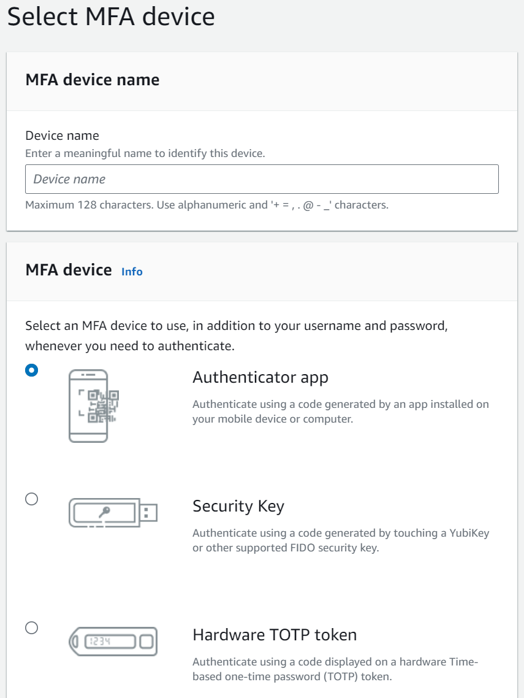
#### What is a Root User
The root user is the AWS account owner. When you first create an AWS account, you begin with a single sign-in identity that has complete access to all AWS services and resources in the account. This identity is called the AWS account root user and is accessed by signing in with the email address and password that you used to create the account. We strongly recommend that you do not use the root user for your everyday tasks, even the administrative ones. Instead, adhere to the best practice of using the root user only to create your first IAM user. Then securely lock away the root user credentials and use them to perform only a few account and service management tasks.

#### What is IAM
AWS Identity and Access Management (IAM) enables you to manage access to AWS services and resources securely. Using IAM, you can create and manage AWS users and groups, and use permissions to allow and deny their access to AWS resources.
#### IAM User Credentials
- **User name:** A unique identifier that is used to identify the user.
- **Access key ID:** A unique identifier that is used to identify the user.
- **Secret access key:** A secret key that is used to sign requests.
#### IAM Role
An IAM role is an IAM identity that you can create in your account that has specific permissions. An IAM role is similar to an IAM user, in that it is an AWS identity with permission policies that determine what the identity can and cannot do in AWS. However, instead of being uniquely associated with one person, a role is intended to be assumable by anyone who needs it. Also, a role does not have standard long-term credentials such as a password or access keys associated with it. Instead, when you assume a role, it provides you with temporary security credentials for your role session. Roles are not associated with a specific user or group. Instead, trusted entities assume roles, such as IAM users, applications, or AWS services such as EC2.
#### IAM Group
An IAM group is a collection of IAM users. You can use groups to specify permissions for a collection of users, which can make it easier to manage the permissions for those users. For example, you could have a group called Admins and give that group the types of permissions that administrators typically need. Any user in that group automatically has the permissions that are assigned to the group. If a new user joins your organization and needs administrator privileges, you can assign the appropriate permissions by adding the user to that group. Similarly, if a person changes jobs in your organization, instead of editing that user's permissions, you can remove him or her from the old groups and add him or her to the appropriate new groups.
#### IAM Policy
An IAM policy is a document that formally states one or more permissions. IAM policies define permissions for an action regardless of the method that you use to perform the operation. For example, if a policy allows the ListBuckets action, then a user with that policy can list buckets regardless of whether they use the Amazon S3 console, the AWS CLI, or the Amazon S3 API. Policies are attached to identities (users, groups, and roles). When you make a request, AWS evaluates the request based on all permissions that are attached to the identity and then returns either an allow or deny decision.
#### IAM Policy Example
```json
{
    "Version": "2012-10-17",
    "Statement": [
        {
            "Sid": "AllowListAndRead",
            "Effect": "Allow",
            "Action": "*",
            "Resource": "*"
        },
        {
            "Sid": "AllowWriteToBucket",
            "Effect": "Allow",
            "Action": [
                "s3:PutObject",
                "s3:DeleteObject"
            ],
            "Resource": "arn:aws:s3:::examplebucket/*"
        }
    ]
}
```
### Creating a new IAM user
1. Open the [IAM console](https://console.aws.amazon.com/iam/home?#/home). Search for IAM in the Services search box.
2. Choose **Users**.
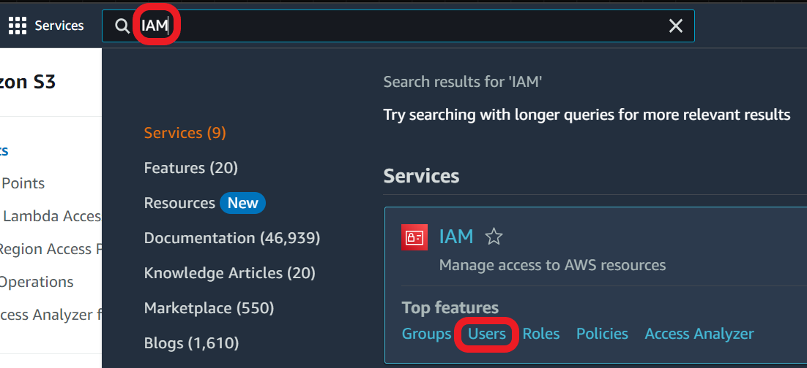
3. Choose **I want to create an IAM user**.
4. Enter a user name and a custom password.
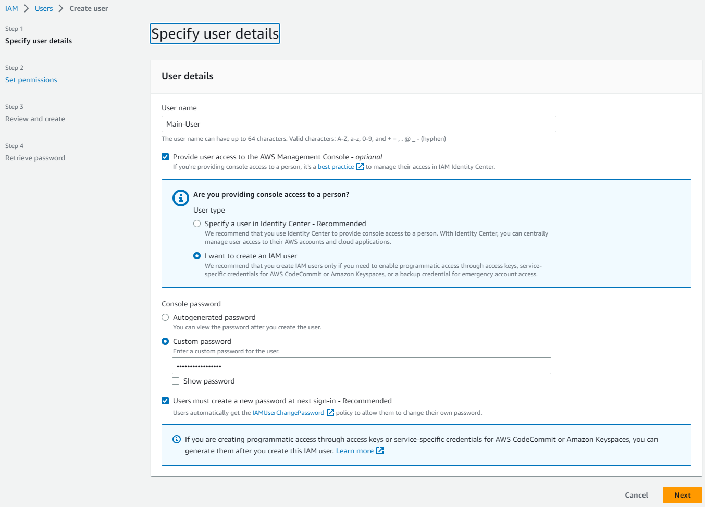
5. Choose **Attach policies directly** and select Administrator Access.
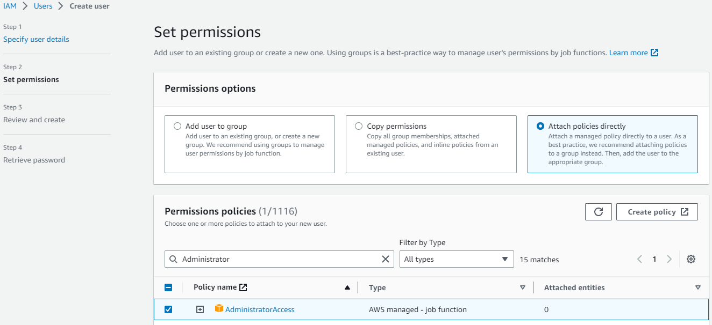
6. Click **Create user**.
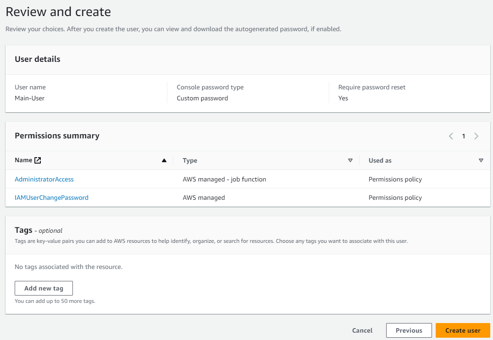
7. Click **Download .csv** to download the user credentials, use this credentials to login to the AWS Management Console or go to the url https://**<account_id>**.signin.aws.amazon.com/console/ and use the credentials to login.
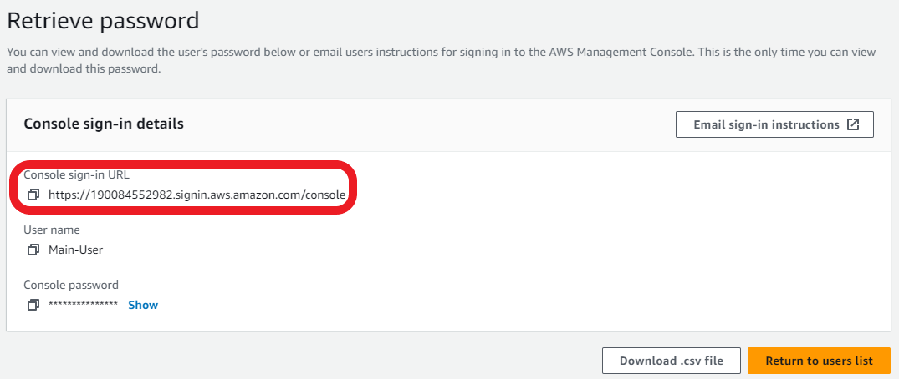
8. Sign in to the AWS Management Console using the new user credentials.
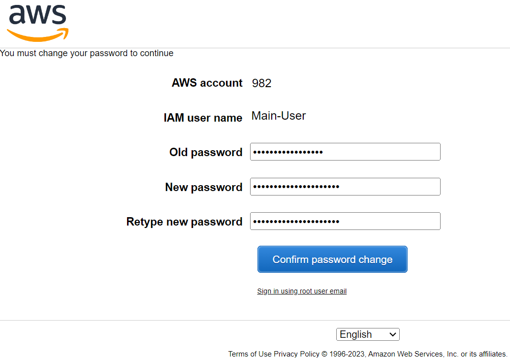

### Creating a new Role
1. Again use the Services search box to find and choose **IAM**.
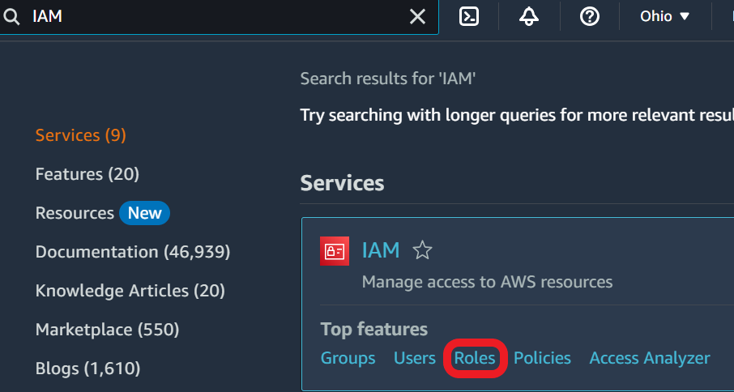
2. Create a **new role**
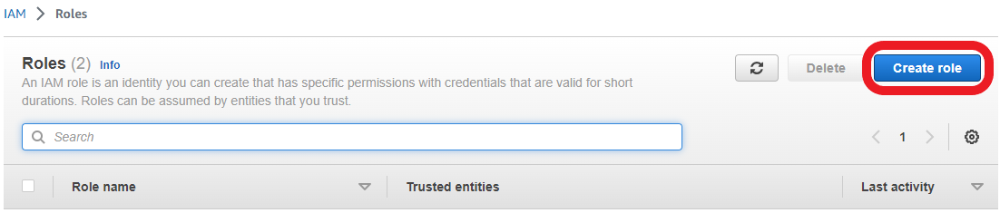
3. Select **AWS service** and EC2
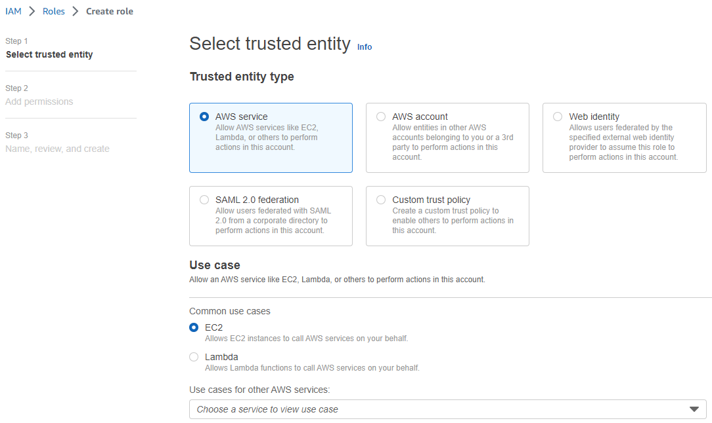
4. Search for **amazons3full** and select AmazonS3FullAccess
5. Search for **amazondynamodb** and select AmazonDynamoDBFullAccess
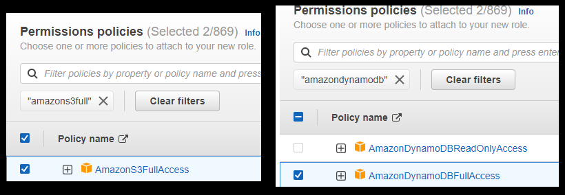
6. Enter a name for the role and click **Create role**
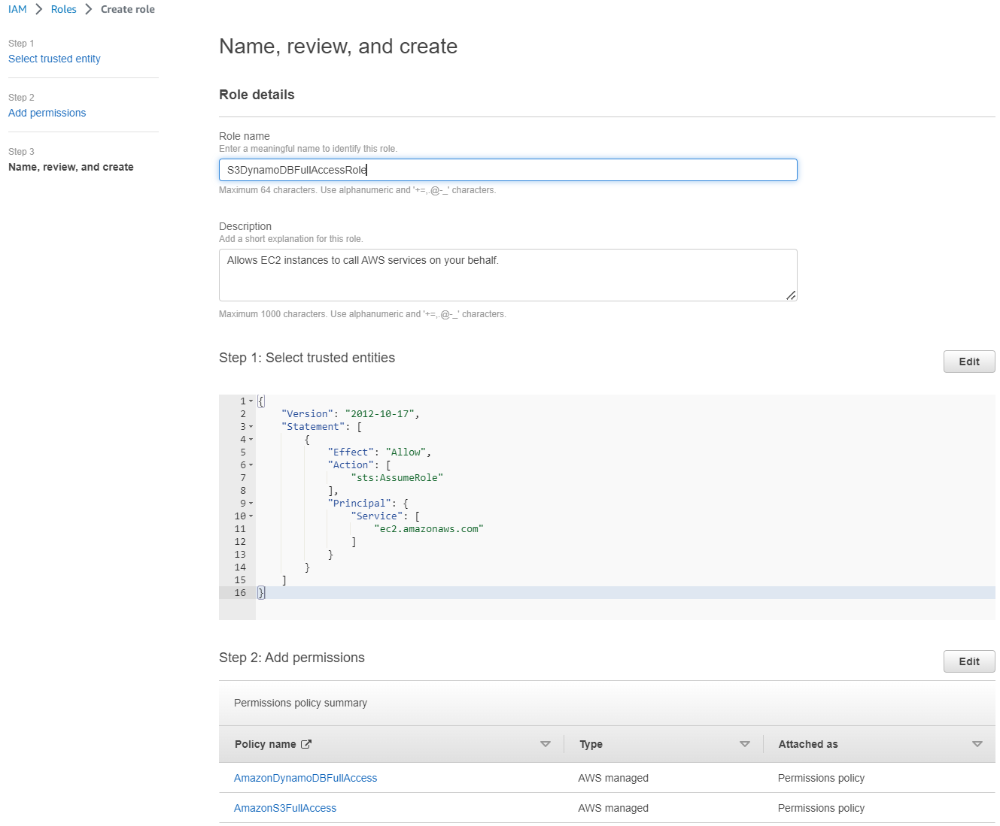
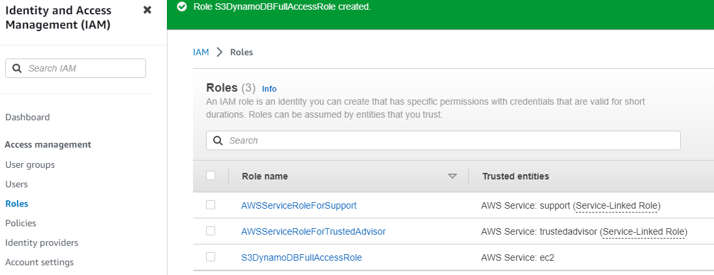


- **Version:** The policy language version. The current version is 2012-10-17.
- **Statement:** The policy language is made up of one or more statements. Each statement is enclosed in curly braces {}.
- **Sid:** A statement ID that you can use to refer to the statement in other parts of the same policy.
- **Effect:** The effect can be either allow or deny. If you don't explicitly grant access to (allow) a resource, access is implicitly denied. You can also explicitly deny access to a resource, which you might do to make sure that a user cannot access it, even if a different policy grants access.
- **Action:** The action that you want to allow or deny on a resource. For example, you can allow a user to use the ListBuckets action, which returns a list of all buckets in the account.
- **Resource:** The resource that you want to allow or deny access to. A resource can be an individual object or a group of objects, such as all Amazon S3 buckets in an account. You specify a resource using an Amazon Resource Name (ARN) or a wildcard (*). For example, you can specify the ARN of an Amazon S3 bucket or use the wildcard arn:aws:s3:::examplebucket/* to specify all Amazon S3 objects in a bucket named examplebucket.

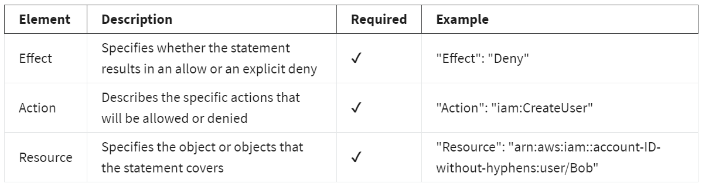


## Ramdom Notes
- **Comand Line Interface (CLI)** Is a tool that allows you to interact with AWS services using commands in your command-line shell.
- **(TOTP) algorithm** Time-based One-Time Password algorithm.
- **FIDO security keys** Fast Identity Online security keys.
- **MFA Multi Factor Authentification** Is a security system that requires more than one method of authentication from independent categories of credentials to verify the user’s identity for a login or other transaction.
- **Identity provider (IdP)** Is a system component that is able to provide an end user or internet-connected device with a single set of login credentials that will ensure the entity is who or what it says it is across multiple platforms, applications and networks.

Working on my AWS Cloud Solutions Architect Professional Certificate
